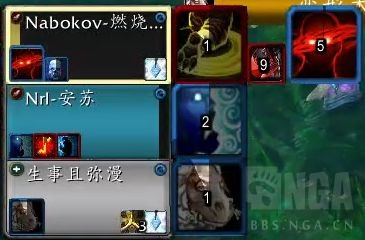
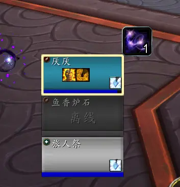
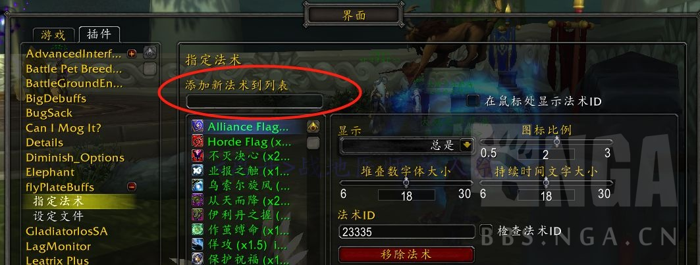
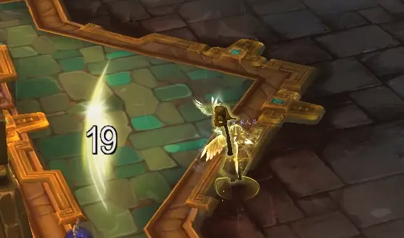
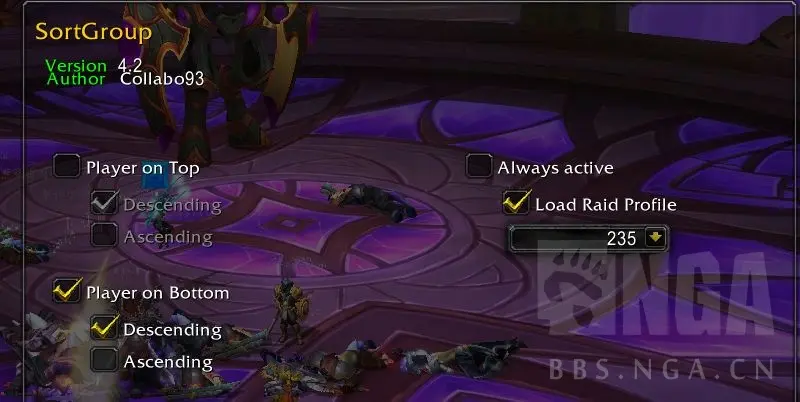

# [PVP] [神牧] [SL] 自用的插件和宏

## 为什么需要插件和宏

插件能帮助玩家更方便的接收重要信息。

宏能简化操作并且保证速度和精度。

## 通用插件

#### GladiatorlosSA2

大名鼎鼎的语音插件。默认设置太嘈杂，强烈建议禁用不必要的法术，“少即是多”。

#### sArena

竞技场框体插件。比同类插件简洁一些，并且用了十几年很难改了。如果是新玩家我可能会推荐GladiusEX， 可以在看框体的时候同时看到对方的关键技能CD。

建议两个设置：

- **Layout Seetings --> Mirrored Frames**

  让职业图标显示在插件框体左侧 。因为我习惯把sArena放在屏幕右侧，这样职业图标更接近屏幕中间，方便观察敌对状态。

- **Global Settings --> 取消 Dynamic Icons**

  建议所有的递减插件都设置成**非动态图标**。这样只需要记住自己技能的递减类别，而不是所有控制技能的递减类别。

#### Details

著名战斗统计插件。

## 监视Buff，Debuff

#### BigDebuffs： 团队框体debuff

同类型插件中毫无争议的最优秀选择。需要开启团队框架，自定义性比较强所以可能要多花点时间设置。要说缺点的话一是无法在游戏里直接添加要监视的法术，所以如果作者更新不及时的话需要自己编辑lua文件([ 一个例子](https://bbs.nga.cn/read.php?tid=27552402))。另外BigDebuffs在姓名版固定了只能监视一个buff，所以我选择了在设置里禁用nameplate相关功能并且用flyPlateBuffs代替。

**建议设置**：增加最大buff数量



#### WA: 团队框体buff

基于 https://wago.io/NCj_4fg4O 修改



```bash
!WA:2!DF1YVXTXDylVWXOSPn2QXUUX9HsqTrKDRm5W35sHO0UwYwpwp7kz50hAhso7sAXLKEiPESffnr1iWih1PIwGw09yroPd5paFiNhi0t9ObQlAp6)c6VHlvIJC6J4cBGO9WodhoV(99997Bgo2QJN5QoL5ukQJ3FC)X9FGMtpwYwoluVr7h5MW8PmhI3g(SK00Z4efoyaH5pr7KKO8Wu22l3TBgnFS9GXuKoVxs8fo5RD5D7Xc9BVtk9TWZoSBru0mHmViAhCwkXJwdvWIsVyqEEA27CTRTfPxYuHjxBPzU76AD7PT81qmIxEysCMbolNWYLCcJdZLC7cfzbs7MZc71JYYEJlZQQ(bd9PUfD7kwt2C1xOzJvwWjhEatkye0UzP0OO59ZKEuwHlDtACElO3HBV)6ZmDR2R3Q90424ysFAMKtbSwUPrKDOmCzxDNJsIYd(0H2KrHHIB1S(clSxrC1wqAFVKOI(XTeH4PDze)WIS7)Q7LrJ62mjeMMzQVu76ymjkSxm)smi0eJBm2MqOar7PgclaM2te4s7rId7teGGb)B2GFoN4Ky6dPKmARCgnUxEWPpWhcnrpwxeOSmka((z7k6Jag4x1Ppjmggl)Q8F0P5)y(u8RbvpZrBXjkH4VQBojcITZJ7xaeRKtw4a655QsyViswMOMdaIEIkSbWEbaZtMEMIm60XEbjSMu2kaU15a3kTYmjrjSBuRwTM1KNsF)rcPrno2yJvJnk(Ob7YsYlJIXWzEWwO2UWCUqyFyUChnOGHJkR73JME2w3RGWOt0aevtC7GWC6qwjKjc5h6VdWHHELAXQr1cIJt5KLWY5xTAxmFmOyR5cWv3WEs4iXID69es2Bh6da7JG3aKtCEdqgMWCXtp78R0c2OBnIBF4OPzKY)R5Mr7dmiwzkLPKhMN4vrNxySoR9wH(PJ)3(9d)h)2)4J)tFWJ)dF8F)d)4h)EV)bKICaZwoTuKlTFxgO8aELKtQ9esjE2q0KiMCBndUE9LoG80W8ERS08TBGNEX6OIq)9VNzd2Qlni46tU2EeM3cL6J7F(9RgJq8b6TDQsvhk0jHvlDyC3e2iHM0tG(rzXKOvhfb0X9(Rp4sddH(3kPG5r)UNGJL4)SX4)u(LoWdCa8t2kU1wHP0o8Vo)v5FdqRkXFnj(zK4NDPlZh)tgMfKS1mrWCL1Hbe7squ1zprozzY2nWizDBnSULTLMlYwXwtZv1qvhH4Fp(3N)gs8lIlzt(3wcKTNNFb(3H)d4t8eyUQVnqpTgLyhW)w8xN)Ms77hMD3IyW9ytkIeVt6zjL1BpkhDXeF6hDc(60NSbLMoTqqNJfbFa)kJYZ(85kY)3ZEaJNmsUitKgWF7tXN8kNNFUdGmzrIGyRh73Ts3TUiNQ2bvpKuYg1QetR79PPgvMURVzywOlyAE4OPG(Npn)C7jM8YMCdOH9cYNKRSjlmUeNe5N7bGZ6XGvflGJenW1k)3O8F9Y)npj3XrWS8FHe)hYV0dpKofzzb8bD4RTFJbZ2FNb3QEZMTsF9dFFB625ZgMrGDMFh(s8L5nRu6pet8cjrt4t72jdVLivAsERA828vapV0asn(1LG9Pi)GgG9o0GOMZGKK(cBcv(pxA3dxOo8xzShCjENNw0Xj)BeAp4Spcc6fj5EbascEYbC)bynltztSUosvvu3g5QOPBGSDbDMHPTOnn4n2YilHOQud52ziypNWOZsjGS6UbPNdM55lB6ZR4abA64v9nmdGYyqnrHxCrEOqU61rOyFuLQVjjxKCfuQGbD9BkX3GhX7xkh5Xp)cqEYNP74PD53RgNvJNvkL45D4fcndFt(wczcF7s2FN)Zcd(Gkvb)xwjfwSR8DgmP(C3QFx(V6i0oau5btCZyHuK)RpKY5VNGU5VFaF3ssM)BoKH53)lf1(jaLiWs)3bRPRPAbKNSQInwbPz(zUeJG8NYHayUkpHVkHZZF9gOBDNvmZ1N7O4SZIei))fi((UUilffBDxfldKHUJUQf4mRQzj7Imrgwh7a7LN0C(7o30RTvy(rbB35keNf(caUFSaUfqN)hIraGJWgkQQgUkYivnWGYgjBP4QkRRzBk6GOnDDl4irtnz4Mj9DdJPvxdiOIr2pD0ZIJ3qKOOdzOkMrqsab)vpcAoRfF7RBD3gB0dFuccpldU5Zlw7gvfesZbaEthfBdJJBY)zwkPVzYgZU2Dg8mOloPxXluZMbUkk6izvxvesx2u8KIjKfOyyPbNpJqMwQIcOekG3PDCd(ztQTD)Tg8UXZ79Sw9jXB8)m6p3p5vor5VNhlFfltlKPlWeMizW9XWurCcRfCJCXt666h3W9IuVjxTpo)MkZ8fCvM(jXt8L07))d8)pd3IX2uhJuTfOVSPUPgYYuXbPBiohwt1qddf2azOyjRAHTn1mqoQAkkh34f3Pv7U8oZUmtVXr5f2TjmwyYlfk5kanyPPioqwZ0u9y3fmnu3iU(SO1SM8lcLJs8EPy88pHdxTG72yOHCmS1KrA2wWDnnKLfVaP4axhcjQQlJTmm0TbhknzWAcPyOQQisnmG8aGJ0GMKH0LJBe1CQRUYQRTI(nC1FgIQjjI4hg)YGO(Dy4gPQgyntDlDSQks2adFDGIf0IPLGpunuKllKryfzzd4bve8D3h3iKi947nZYt7GjbpZxl0KfsZYFjDITmCGTszHLm22sgQaNkajiMQ22h3q9boXb3jQ3nvmEMlP62kG0N8CKfm(M)L1(x
```

#### flyPlateBuffs:敌方姓名版

专业监视姓名版的插件。可以显示多个buff/debuff并且从游戏内通过法术ID直接添加要监视的法术。由于这个插件已经3年多没更新过了所以直接跑会lua报错。解决方案是从[https://www.curseforge.com/wow/addons/flyplatebuffs] 下载之后打开World of Warcraft\_retail_\Interface\AddOns\flyPlateBuffs\flyPlateBuffs.lua然后删除第394，395，396行。另外某些法术默认没有监视，可以在图下位置添加




我目前额外添加的法术ID：

（额外添加的法术保存在：WTF\ACCOUNT\<子账号>\SavedVariables\flyPlateBuffs.lua）

- 援护：147833

- 终极形态：323524
- 缴械： 236077

- 战旗：236320
- 征服者战旗: 324143

- 龙息术：31661

- 集结呐喊：97462

- 真言术：障: 62618

- 强化渐隐术：213602

- 庇护祝福：210256

- 神恩术：210294

- 神圣守卫：213610

- 美德之盾：217824
- 野兽之心: 356976
- 大地之墙: 201633
- 根基图腾效果: 8178

- 操控时间：108978
- 思维窃取: 316262
- 巫妖之躯：49039
- 自然迅捷： 132158
- 角斗士的严谨决心： 363117
- 角斗士的永恒结界: 363522
- 角斗士的决心: 362699


**建议设置**：

- 在图标上显示持续时间
- 显示时钟动画
- 禁用Show Duration(否则有两个持续时间，看起来比较乱)
- 只显示法术列表（避免被无意义的附魔效果，盟约效果等污染。某些仅在玩特定职业时候才在乎的法术可以添加ID之后选择仅显示自己释放的，例如dot职业的dot）
- 图标比例全部改为1和1.5（默认的部分图标比例是2，个人觉得有点大会挡住其他重要信息）

效果：

#### WA：自身buff

```bash
!WA:2!TN5AZTr1zCCuuj0iOKetiecuAkZ0usBhhPvYsYmtFHxBjFtwYSs(6qR1UAxPDJL0U5SR8TEHgxi4qGCXeiajucEOqPxOTIomH0c0XFcEgpD4dqgKn5T5dqPpNDxzlll7yBcDMm2(fY7E2ZU75C(98))Z5Cwh9wNUG36duVhV1LRoX6eNQE2me1r54AV12sCDbvIOeHLp1WIevnT9WMvzIj4jIhkHQAwdfT54lyiRsIPzOOMx3fz8yPtRlz02)EOx)vFMV6R(Vf5ZNcVE3Qk5neAou0eH4MjDHSzBwHKkRusoDn(us3nHpL597Nt3GNy4IvjVIHlH04)0LDnPbrjtgjI(bpmX(WtoJOKqH0PtmUMePTqr6oCprynWt44lq4zMuxtkB22f1DDD9ccsJiL3iowBLXkouZnfpXqXt0exc2c4lrqll)4sKfRw3ejSACX7ouKiCMLi0MeFwdzU885K0DnDH82nbxftPMTqU8XP9aNceErLc6p79nzbDPik5uW7GpRsM8WUiyFIEdoMbFjCszmhOyZQYlgMvxzcP9ZLRaou6IfB0P2pCexCPYYRRtpsWGpl2eOhoNGndAwnRkPdNoD2Tt313WKzikI0rHhNRfcFELC8gsYC6PW7ZPGf8KNX6)HeZiPT34hVapr6qHrgCO(KvmKMHy2KOpJzfhh7LkPq(xqZ(UIJTW7MvxLyWMxnV008KurKYNXq(z3)06sztBsw2iHcNysIQbpfJoUjwKejpF2ErOHfiD9uyF2GpVrye0QebUMAP9EIZLLooDVZA9IScC2vrRZAppEIZzmutnI1Z4aos2)JRiQTNB8Afl9PVnBpHdVWLo)x(ENCA6iqFkIgY3BX0eesXni8g8oVPvKxyAr0oNq8M5cfkk2kh1gzyJkTsgxmfuel2AqMW9l2zCHetqgRCm8X82YDH)z3KSg4D4WHZzW7uuXkIVOs(0QKCMDCxtBra8q)W3jmSpi4Ss860wK5q29mNigDsV8q0yvIUe9bPpjTo0MieKnhVsEZBe4UhioKa6bpC3vxsDPUYdn1HNrbV94QfiPKE07cUhhW3g21CPqDPO6O5JpQIMuYzlFkf(YW9HnlxW97c2Tlyp3)HH9(U4d(bNMQzmdVpiNxpbz8aFx4XGhbEuy)UGhgoibdPJIxoj8qWbGVNlOo4bGd5sBVuv7isjS0dDPkk9NVl4NkDZHLK0AIgmBWr7SYWtvE0OYovV36UjkY15nOdzsYe74aNWHFY9d7Boulrve0q18ItDaThZqAmJHm)XIhdPnKHsoj7ZCO9WROc62habNEXR94)aTAutn7d4OprXRBEPLc(BQNeX0EaZcr3qvAaqkZas2MWtVP1dszmjRO0tmNvG5awrzoM186hRGUHs6XHDnJPkskbwiB0yrdb7JGDvADMXSIPkl)DoTDlmVXmHgtJiPRpk)4A7XQXjZJuFPiwT6QO4YVz7gs)Lp1SkJIX69r41MSp7dMBXxJPzBSEseP9OHSFpv4URT32Jgne3qSXsKiwxMzpS6AJOORiGE9lRnS8xk9PtnA8ODKvdJ2wtdziJ9uzmOECTV)QvxCWiLIzWYNpxMSQJgMiD8cs5tnE3Fl31Z0G1qk9cfP)uUPmj9eAFCoHcggQ5JHrCyYHzOfBz59GM1V8W300tw0n25SOkP1YLiBEX4M2WS0dtA2qsiRKA48iPCAE9ik4X718fWAzvlilPKr24eWpSx4NqT9HNW83FS5V)i6VKjqdvm12oaFSudayNUGUDvuurNMkRDSKDaD5GPajR2JiByOP)Kh9OJYNrTEf1JYkf0xW27TfJJ6b6S4GYEARqSm91y2SqyNStOQMZHGUuoSFZ5PE317gA221D2sp3Pw4m)15pZlo)zFBUrndJX0BAY8oHwH2GNe2f0HlIsEQifZ)SuqQ2(k7arJOBrrNhdfetcXCnz5lKeMo5uhg6d9W6YHTng0Fs4cWRGxPSp1tNeg8GCn41xq3vzprDKOgtOtMTZe8ZmnIGFUSzlBiziPTTbWp1babhqk0Nre16GHP8aYaYGcCmy4tazDa5WBkpOIvxdoUz3aiGoCcNqbhWVzCyuymyCyc4xa)s4xLe(1oGNXdmIdqcs)5WKLdYGFl8cYWZbNeE(heMYbCkRN0Z6aoTt4LCcVys4m7foRmCUkW953rLS2M((GPHbKHRqh2SntrtsQxzfMPvvYUxrjwM)720)VdxWfDaVvs41GxFrkpjl7cN6AlCQIMmnSt4sNaUStmqzuXHBqCaUrgm6rG3uMgW9Y7aJ5GFNzpYMDyPlXUbQzUglg61lJB)vZqk8ww2LBbdrwSPyiIikeryvtiIWvWXYziYRvWqKRN2eGigxjdxHKLsvkdPr0DBo4TzZiIWGDKoAoyJPcnw)tqPdIXkz4SlCXl9LN(DlDMtxAQpIcWWwkulur5ocWUmrpglDLk0E21yzmSA5NFg)EcULu(vP45RPoeh9rmGaOk0ju6DEVf(K33exx2Pn76SyEjz3dwOdTgJoGT4Jggzka3aKZxGabdULu0TPLAwkvC8gbwNf7IJmy)DNwQ3bBMYLQSor29(FXN8z2oMucAP0qetPLLuRchX10Z0kkBP5NJ8tGXJx)UzwfPhI4vWVnD45AbDkixxeh14RTw1k85Bm5QTKWsPsdLr9qnfDZw6FDT5FLPM)QN7gVX5QoV3a94pqOH9h8ydYBBBAL3drATMWYYKDvWnpRyglpDYvv3TPdxxlB21n3Sv1RTy9eo))qgsk06SytEcs6iwNU7B4gPizfQUpyQsV0FA1sZTtZj5SAAV1CIMcmEzc4oWwYuD7SCgUbKx1CvZw6QV48x(sFXhFACLbvNXQBL2ti7RPOKezPyWMjv6TzjJ2SwuByZtpngWTFpBaZZBvYV7m9b30PewnZtH5VY5x4n(GQTnBtRzFgTY43F7bwfBZ11cfe84XFqFnU9Kw24tAPlRPD0zXmtKDWOIhtw8PARglwqO0V)JOZ4Cj)tlsVKODXLjStxRt0zj5y94MHz7SERtABUdolJBr64iteTlHX8P6JIMQ52x8zV58VW7uXSnT2aMAbUfxF36eC(B032txzZdUUJ4MPPo40hU5C1cC27VYxxWv7vi4MPb)BftYHd(wj4OiyPzawRvyFTNNQBQkF145u0ZPR4lqprSN2iAdEBzkkRp0HML(8Tn4wlW9Lp)FCHl83RgCprcsHqdmylXce72m4wVBMPGhFbc617wY5Oy58zJnCGVZId2wtcrY16e(90vTMTX8N9FyN1YE2guSVYDKCZMsz12nm6BPgApR9fJXBJmBOpOWTT9v5o71gI8Ev3hZfU0Nw6SVu1RkmyqIQx1whyqpekXrrLLsf1dR)f0zbTgd4ZpZwY1MtJLV1a4gx6Kl8pF5QbGu0MLMGJ54E7CGkMVX3u55QXClXf0f0T3GBGzxER42DG7RfYn7r(olMUR2zgoyZXhpEIA854ekDQZx6Y)Hk8lVCf7Svxo(gYUCneEcmE97LzR53FDt77BjxTMBcsVALxCQxB(lEXkMCJ1sjIzKByD)EhJnA7uM)wLNAtxo2G(LSb9ei422LRQD58x5Jl9wxRA7Y(4hlN24TQ1pPTB32LldC1C3ND7X)gBwL32wh(DKtffrRL7kQc6SylEh(4n)e9obRCMA8P6MT078ELU8FJU11Z86R1kXxJVDWT8Z(41xdmE9S9(OSP(SplMFu7491cBWECBWCSASzkZs9nF1lsX5vNAfF51D6APvuSsaUo(K5cyUUgyy2ETbRxZwk6SmBRmrK9A8w50BMT05U68x4JUXF5cZ)HVs1RS3n5PygwI749hqzzFcHD6QUr(p9))o
```

#### WA：其他姓名版监视

```bash
!WA:2!1vv7VXrXzCF6uiWMqAIJWnkjKgOQPKevhFXPyAluWRZD1h1VCAVZXoexUB2DM72jEVDwMzwF2gAHCXnYqA4LtTvIkv1Q7BvaFGdHesacu(l4rw9VaRys5R5d9RLNz3tMan50PDND2NN55LF)(9SzUWGk3rhESHZn6GnhKoiDJH7qKEtXcBO9xFOTCfsktAt8wIkfrr73oGV2Aej94veIanpAtsS2xiNnsZfHkl5QZwVUIPZ0Je6H7xsWd1UtKFMk5D6LEwticeYNptMmzDurep2UKeVeNFshLMi1w28qU2YToEt5B1wl5nAWKQdFcz)LxRlL5gxVELvJyYjZpvPcZnLTgFWHeljNTTkIfeuKQS2sf7YwMfQlJwZxPx1jgVCLQLRmUtf7ymiUrbKvzYDmRKKHM5uUu(PMYjzh3jzKaTVtiPjtz1joSFky1Ztee3mSSPcYEhSizYqsWfW8elfw7yfBkEto6jjG3ieEqjwBghZ0fdMdRrs3YoqqOfSv81yd50mg7Nw2yY7ne8ewoEbeLYSYvtcWuXSCt3(arAtmB2SLYoYW)82nKCQPB84oNxsc5njAMVJYd9lRBAx3VB6980gSOdu(LIjs2XleheC8595AwxzskzoJBsxfRwUxdPioQVxLXmCx2kHuBhILx36OJtWLEbSAUscLhRwFVTLcnXaKz6KMc4YNe2Bb4GWy3KruSYAzcRA3BsryY86QgqtQyEIqQQTXgtcaJz3KWdtCeE6Ddpd8RHNfxUVV)oBH(HT1qDbKbjKUoJF(IZv2jW043ZntZ8u64d1N7vmeFiBxTWB5uK6qzQTWJZP3C7B8HF97(VU1NETB9PVzht3CEov7VNE1LiWJjortYENukDbZwM80T8eo5Zpdw3TsPbUy(uN3W6SXCAVLVWANBb10nwA2I2yRSL95ND(zKR0xE01uY8untpEyDHmTHz1rXcQNOAoBLzlnO3P24KioOd4HyTmxLPkotE3wKgIINVtazTxG8Bg5Nng8at(CR9p(FF5adKb2n8GrhNYvgMDf2k6QPhD1OQAEtw)NYeTFVyLw00yXCruKUah9SXYGOJ4R1rQF5zoJjgdZfNzNGCMCWEmWPKkQ2iq0YVN5A1uTRTpNYCuI4qA0Zu0igQJnKfhNsXcCX5zKLghHC1ILeTyYKLtZOCYILnEOwSfpWNf0CyrJgTXJp5CQbpSfSpl4hSVta7))6eg5vK6M7PgjxUrrAWHIgeLyvjUiNmrJoTGYQTPrMIvUobFK(cLMhW26BTmXk4OWJchdfZ42jhBnyi4hcpIfCOo7Carhi51395vZOQRAMBudomCe4aWGWpYk6aMwWYSkPdgmr49hi6i3tiiDHJbjOWJXA3cjLZljrTNV)c76IqDNsOssKin6ZsZc)KdpeCWnXrhMbagLzifor9KeYm9WpTyWrwsF40MjfWjtUEQKR)u86j6IKygfL9HKAoP3ABcNrBFPnv(eQO1cP0ZSWO2AmZHDzbot(Lp27(pha)1fNnYsfgRV3E3vbg9iB)xVo()wFYnU1N9o3(VT(x9r)LT)KnI(X3FEyKK5XtlTFfYQUaCqxClm0jkDuIF12QaKtPfrjQ9NdTaU6oVSljiYNukoqXsE9)3OHOtF)JD)5Bv1(ye9fb0vHz6DXlFXLMVWKCvopxfRj2iDYn8idpcuO)ic4kYlJAgE9vTNkFHkqXSWZd)2(9TlM23o6aW0wBHFruyuZEjTk7XXhD8sNxp5ZcVT53tNjBVup)2VgcLTGkwWCU2ZwPYStVXjH5HfGlcVGrEVA5rnqGrEdxkdSiYH)DWlMQiHQ(qnGaUGh89KnaZn3i5g9x8ugjd0iLOF5ufGHcVunWh4gQ)XSGM1GWAOzb9z2G49haIGxczQGeuGgIHL7tfHwi9dwXhw9(Y3G1QbVCn4vUe87r(e8h6tMoysHma8QRVx41UZTVYh)FU6N)1FWFE7V49(Q)(RbT3HpCxOnS(9Ida)X7n0dxZGN2NtujF0SJTY5AbBaV(oWyNDIi8gW17JIWFkb5GBaVj8wFhucE7Vd2aVZGl)Vx4B(d
```

## 监视CD

#### Omnibar： 敌方CD

和BigDebuffs同作者，也是同类型插件中的最优秀选择。我的习惯是把打断，控制，爆发，自保设置成单独的bar而不是全部公用一个。

#### OmniCD：友方CD

还有几个类似的比如Ability Team Tracker, 似乎没什么太大区别。

#### Doom_CooldownPulse + WA： 自身CD

我不太喜欢OmniCD自带的牧师CD，就自己写了一个。其实没什么太大区别。

```bash
!WA:2!LJz)3rr19FC2UMcU(eKOPq8jkNAQH2dhibciNt)HS5bj2qsy2neiT1mpD3DgyYmdZmBswARfwrn(mUTIkIA76dGwRqxPkkGAZP1t)P2pnAXZPNtpNVF5ysWFQE4VG(5ZDMz3nqcI4PT22Fj5o3NM79(51N3VVZgzZv7k30kw7kwvtvpu1QvRo2kZl5O0fZmTN2EQ90YwoQmN4skBx1XY2EHXn035oLCuxAslldpD7jKY4Pz50JTNULPBmNS9KkLlZBdVx)PURDnV5nVIsMky79APB6j3A7DNSDHcPYyy0QUJIbtuW1wsHvLJKcF8nl46j54flUUPUxm5u4)C1ILZZrpDAMJBD17eu8ElOYKZKkvYS2mNn0Ex92rFDf3dFqqkJJuJ5CTzggDQ6g70UzKzdZm9sG9wF0Id2AljsoyIKTiKmEg8LiBBiLL5iykneZnMaVRYBGjz4PvAO96WWHkKO327QR8zmdwcXkQyzKziZe0oiQSJKQEg39CL5Y4Y6sFiDpnbjd90MWcCW9enGifWjuGLMFqLpTJUA)6QEAxrCdlj1oI7QVtwTcdLbpvJfhx)k1cnetqXqY1Lkj7jzGRfQ4eYbHJwTmSCUJOrJ2B0vUI14izQpKKhtdNBRm2DQyzU4Op3ucUk4iJM3LzKIhgCs2tVD1EhjL9JTAf8)F7QPz2lkXoYi5WwAhyiAP9RP7Xk4WxX0b94QzXJjDf(0hmQe4QUQ4UwoEXnTmzf9R1FHfjsKO2leppAXNbyo9HN4ANfxdmhtjJnJHu9YdQtteCIEACzJhyMEDGmHLJSqlT1zFjY7V3WE3mCLDa1aRFCMKllHNdhuN)eQyyNAEqccCCz4SO6MJ6dTYH1hFijDt(aH4ZhAfAdAhlE1NBnJ7Vu8H4lphfKOXVmH2k4zPmS)cEXre3YY0vTRU3n370V4Zo99FWPF6h7mh8E)4JTlbdk0Ffft5G8eU6K8KIEw)uGoOQOjtorRcT3E35CSgjGDWfBk90XIJhSJe)2f6SnNrdtJ2JD0)pmnc7ShF)fPaTZ09Z2kQBMYYX)CjwJz0vlUH2Tu2yhd402whUAL9p2YkOJDpHvghf2nmpbLqEjk8vJaZhwWekywSQ1iMjgr3MjoE4JelObxbEwhdU6yWvfdUM7SEyHNYbdMDJBdTXP0mEsMUQBDYnUQMAELnclcQgUE4gGBeUjyXWsGAHVgCDXG6IDwCCTpkgqt4NxkIh7xBEAo45D1D2jpXBp5dTVPo2E)K9V3PoWHLX(lWgsdU5y4R99NaFCqhgfc1ntRzVi650mtMJUscnRr6XuCIz8ybx8FTymIuwxAHmHdMqZF10IhK5ZNB4ZI5lvCXrJlNNAeJCkBxeUE7L0AWrYs71XkTdZ1DP3kFMAaQrGpoAVniUjCLsZdVA8JHBowrvD3TLXef2gM1OKzw7fjXlN0x(yJwQSxDEW3HD2TZy2Tqj8EcuKudwfSauEZvYJyAC(UL1xluZeO4bL3tjFMQJvND1ESr9g0vtcxDBXhxIyVeEL8)4tgd6guawF(sTTSBbvYRy4LtxpTFTHsfXBPVK9yxdVsuO3IqnfUQv8wWhpR)lsFuMVu2UNWh13AWYzCE7BlJRNEQS4MIdXSKyLX7UNUB3(BCERw7bvzkyMUXG2oybkBlcuJdU3PEz)1NLb4PpeRCVJwG3AzspFqVrz9ZS7hyYx4LTByUMKa5Tb90W4Sgg2ZoJd5WD1eLMrU7tp9LSRo7UD)AhbLp63rYox)bf8pcggxBYODxWPEfEIWcSVP5A94)0SfuTdki3DMHKzoLxrKCCdbrHsqXnolJNtrCXsHugwwoNAI0gwJ0HdBhzyMkz79Yw5kACnXP6ehhb8B3iGs0Yr1rB8jKZ45zz2dkkIwOfOQ9V1W1vKkhEALpD4q9fE4btQoEV2sL9kb3OIVqsQPRSDtmPkkVLU0XYlI)oI7BAjRX0tR5Tj4B((54zZ4gxJN6AIE2oAW3MCkHLxVSlkzyWQcFI3m3qv80Lua2UjMCRDAE1yGrLQvjgxHWEyBFtxr4BvpCi5Ef6S9ejPjQul1chkAHYZdPFa3k2xb0e1ucAOE4iIfOSyvEfIqZXjfzyZXIVtlRHIaDf1(AdvDPeJ20DLqsrvdkkcDg40i7lmc9xSvH1WwRwZBC1mt86f2AsrfgHY82euvmO3yo6MKhfQzKicSrOBOV1xVGIgtz7ndlSQCdl5OtZEblZqznHHLmYWI6OOjzMM5U86HtkMZgVBbZXllG384DPBTSIMwbD2xp8248efoECsFfozu4D4daEx49WEcU(DOk44WjGtgbBT2snLlCxkcTW9WrtxY7n0kUJZRMR(CRzSLbB9gMhTt9DVGVNi89dTPUkUtLVnf8d0arrqrB2DJG703XAvRKSHaP6a5anBYSbRBiGjcPG08HPno6Xp5bE(jFTXM8H)LGUiVVM0CBayCcTj2gg33goCWcSHDWv1bebBj8UkvELJo(SVec4gO5dEJvhSNOWWyDJGI2WOCrAilSt4hc)i4hVB4UIa)e8KyxWUHCOsjC3qMiW94NQDVW9b)SiW9hbEer4HGhgEa4bHhf79Jb5H9gb(PnaJLfECyFNcEc)eECcEo4P0G9dpnCGRdEMiWZ6pvpPi8ZJafIc)IOWZVi4f0GxKs9GxsdoyyUgLJa)kQ0llcVIgM7bhIs7GxdZsUMCbzCkIWRkchUuMcCe)Se4xJjhqryCr41JaVzu4OCJWs5aWVd5BmDHJ1d4VQ6Vy8032qTSQUs6SLTbVfN6p2MiOVsoSck1LZJLWy43(5JHX0wmTmadX31SGHvEBjoDrux49IiCIOrKnlbInTQMBS5gjILZHkAZjgo1UEMPp(rN(vU7jF09ry42w8L9bPi8laendV5X5GH0P4mikKq(CruibwbrHidsuekrifswerH0ebvirHa3mikKCMnGIanKOqCQWCtube0YXZlcPeRaX(9AegrK18ryIoiMnyc1q3mhAqycPQsS0FarN0Dz38a9TU1TP1DheUHCtavHygIsOktGa6)KyPX)cleErOcgYuH6GCMty1RDnn1mHGeyjkodoDUOVjVNdH6GN5OhEQx)qZUi4cERJCraFFjwo7nUqWNgHCL5VxREI8AO25lEbWVlzdaKnqKej2JoJ7bK3pim9t)oZMwOYo6P5rnKBn9iE)lslSQyZHwiUM5m4y1iW)sQ40hpeYt1flFPVL7RGQyvfvGqicajudjk7AiZcg9bJL)mnTsoXt9up4Kp89rqiIWehsKnbSBxSi)kEAso4DzcusFdQPCH)(av3iK60U8psm8kq(aomrivZOV7R2sF3NatsnBPp6J72tR4Vm72RnRPhlzwtpW8GZl9atzEsTplT5Al70tYWxoQhJ3XBy8wUME(Po1wvLk2ZTLFLsxKEH)vaqb4s3)9tE(Nf)YTqupa8XuG(l2wpd0FdwdSA1vVwc69fY7B5LbxFSUUqSUmVFIz0aNNpQwappqL)ijNhtd)r4pvP4iquC0LMiKI)aFzX)mrStv84tVVN4JFRhC6h5WvqSeTsulItOKCzof(qcqH)sat(x995P5MOs4u0a(3GjV2mm5xY5zYpx6SiCHG0f(AJvcsvOVIivnWhvgKUGxA8OC)AmcICtL3dleGAKo9tejap6V4k12YogP3D8DV1r3AGDpbuix1xDZnG8f3W(IhRqOGtvx2NUvowqyLAzSk)upYbN8DV7Poqit9bALecrcHGN5KP(Bb3D8t35NftDPUB)pgq8nMlqCCUnsGyMi8r1sy4fJugYFifwjcEuUtC5VKNh4iA9n9vX6V4ALAkZo6QP(UJeRlagrgLyXlfvmesrPGl2Vuoa6q6zgAzrgyvLOoKedPUZIEVN5q7cPU)(j2)0NC)NJdS)1arMAorV))kTy9bp)x2)7zM(sZc6vHA3m0cF5lK0xGMIFCp4kJLL9WGujzpUFP7Q30WgjVT2sFBYePfyLEPAyw6JHpxs7cBwUGB(TNnVsmXy6D)BM8i7BYh)yF(9k)yUUgn1)xKv5lnh)clZevkPCDbDiphHjevQqyQXP29EdzPqxYg2y2oAmU8ozPtDoUKxIktxQgkvp8hUL)X
```

## 监视递减

#### NameplateCCnTrainket

姓名版上显示徽章和递减

#### Diminish DR Tracker

用来看自身和焦点递减

## 其他

#### Platecolor:

当前选中姓名版右侧的蓝箭头


#### RETabBinder

PVP情况下只tab敌对玩家，PVE情况下tab怪

#### SpellActivationText

暴雪默认技能触发提示中加上剩余时间。需要把`界面:战斗:法术警报不透明度 `调到高以及选上`界面:动作条:显示冷却时间`



#### SortGroup

固定自己在团队框体中的位置，方便用`party1` 和`party2`选队友。



几个设置需要注意：

- 禁用默认界面设置中的保持小队相连

- Load Raid Profile里选上你想在竞技场中使用的团队界面配置名字

- Player On Bottom是让自己在框体的最下面

- Descending是其他两个队友场内外框体顺序一致


## 选择队友

```lua
#showtooltip 纯净术
/tar party1
```


在队友之间切换加血是治疗最常见的动作。强烈建议绑定鼠标滚轮上下，保证速度和精度，尤其是配合SortGroup插件固定自己的框体位置，非常舒服。

为了节约篇幅，这里只给出了选择队友1的宏。如果键位够可以根据下面的列表添加。

- 自己: player

- 队友1: party1

- 队友2: party2

- 敌人1: arena1

- 敌人2: arena2

- 敌人3: arena3

- 队友1宠物: partypet1

- 敌人1宠物: arenapet1


## 框体宏和焦点宏

这里值得先讨论一下治疗在竞技场中的焦点设置问题。绝大多数情况下治疗的焦点目标应该是对方的读条控制职业，例如法师术士鸟德(猎人不在此范畴，因为猎人的控制是基于CD而不是读条)。如果没有上述职业或者对方两个dps都是上述职业，治疗的焦点应该是主集火目标，来观察重要buff第一时间进攻驱散。对方治疗一般而言不需要设焦点。永远不要设置友方为焦点，浪费一个通过宏来节省操作的途径。

但是作为神牧，总会需要罚+恐来配合队友打双控/三控。这时候有几种解决方案：

#### 1. **手点框体/姓名版**

也许听起来不那么高端，但是其实这种方法大部分场合是完全可行的。尤其是如果对方姓名版附近没有特别多的干扰或者对速度要求不是特别高的时候。缺点是有可能失误点错，而且意图比较明显。

#### 2. **框体宏**

```lua
#showtooltip 圣言术：罚
/stopcasting
/cast [@arena1] 圣言术：罚
```


不切换目标直接对敌对框体用罚，尤其适用于贼法牧面对带开场隐形的职业第一波的时候 。贼法控一打一，神牧随时准备罚潜行的框体。

框体宏优点是永远也不会出现点不到人/对方清目标了等问题，缺点是每个技能要消耗3个键位。

#### 3. **焦点框体宏+焦点技能宏**

**将敌对框体1设为焦点。**

```lua
/focus arena1
```

**直接用对当前目标罚，按alt对焦点罚。和上面的宏配合使用。**

```lua
#showtooltip 圣言术：罚
/cast [mod:alt,@focus][harm]圣言术：罚;
```

算是对前两种方案的折衷。比手点要准确，比框体要省键位。这也是欧美绝大部分职业选手的选择。

最适用的场景是能提前几秒商量好下一波牧师控谁，提前用宏设置焦点顺便观察下焦点上有没有免控buff以及递减情况(配合Diminish DR Tracker在焦点框体上显示递减)，控完之后再切回平时的焦点。

框体宏和焦点宏的不是二选一，完全可以根据习惯一起使用。我个人把三个框体宏放在了我不那么容易按到的位置(`F1`,` F2`,` F3`)，主要开场用。焦点宏放在了三个最容易按到的鼠标侧键， 大部分时间用切焦点宏+焦点罚/焦点心控。偶尔手点。

另外切焦点宏也很适合玩DPS。平时焦点治疗，打治疗的时候焦点能拆火的DPS。

## 技能整合宏

#### 技能整合模版一

```lua
#showtooltip 恢复
/cast [mod:alt,@player] [help]恢复;[harm] 暗言术：痛
```

对敌人使用是痛，对友方使用是恢复。`alt`对自己恢复。

#### 技能整合模版二

```lua
#showtooltip 
/cast [mod:alt, @focus][harm]暗言术：痛; [help]恢复
```

对敌人使用是痛，对友方使用是恢复。`alt`对焦点上痛。

------

两种整合宏的区别在于配合组合键（`alt`)的时候是对自己施法还是对焦点施法。如果是`alt`治疗自己，那么你还需要焦点进攻技能的宏。如果是`alt`对焦点施法，那么你还需要一个选择自己的宏（如果你按两个组合键速度一样快的话，可以用更优雅的解决方案，比如shift对焦点XX，alt对自己XX。但是绝大多数人都只按一个组合键舒服）。

曾经这两种流派都有人用，但是现在99%的欧美职业治疗选手都选择了第二种流派：把所有整合技能都加入对焦点施法，再腾出一个专门的键位（`/tar player`)来选择自己。如果你是刚接触治疗，那么强烈建议也用模版二。

我个人由于多年的习惯原因还是选择了第一种，只用alt奶自己。但是即便如此为了保证速度我也做了焦点进攻驱散，焦点罚，焦点心控等宏。其实相当于没有节省键位。

另外，很多类似的宏都会加一个`[]`空状态来实现在无目标的情况下对自己上恢复。我不太认同，因为可能会因为对方假死/消失/影遁清目标损失一个GCD，而牧师是场内最缺GCD的职业之一。上面的宏在没有目标的情况下是摁不出来技能的。

------

#### 焦点驱散

```lua
#showtooltip 纯净术
/stopcasting
/cast [mod:alt,@focus] [harm]驱散魔法;[help] 纯净术;
```

同理还需要焦点罚（上面提过），焦点痛（万一要罚的战士开了盾反），焦点心控等等。

## TARGET宏

#### 不切目标锁XX

```lua
#showtooltip
/targetexact 喋喋不休的法师
/cast 束缚亡灵
/targetlasttarget
```

暗牧放通灵盟约技能之后用这个宏就会在(感官上)不丢失目标的情况下对召唤的法师读束缚。原理是先选中喋喋不休的法师，对他施放束缚亡灵，再选回之前的目标。配合WA提醒非常克制暗牧。一个实战例子：[https://www.bilibili.com/video/BV1cM4y1c7MT]▸

除了上述的主要用途外，这个宏还可以在场上没有“喋喋不休的法师"时用来选择之前的目标。几个实用场景：

- 集火敌方猎人，猎人假死清目标，用这个宏可以立刻再选回猎人

- 参与集火敌人，突然队友吃到控制或者血线危急，切到队友加血/驱散，然后再用宏选回刚才的敌人继续集火


这个模板有很多其他应用，比如锁DK的黑锋石像鬼，以及PVE里的各种目标。不能用在暴雪禁止用target宏选中的目标(例如图腾)和某些特殊NPC(例如邪DK天赋的憎恶)。另外这类宏只是简单的选择叫XXX的目标，分不清NPC/玩家名/猎人宠物，所以如果碰巧对面玩家或者猎人宠物取了一样的名字则可能失败。不过“喋喋不休的法师”超过了玩家能取的最长名字，所以还好。

(我不确定可不可以用多个targetexact来尝试选择多个目标。实在找不到邪DK和暗牧同时在场的时候测试。)

#### 灭

```lua
#showtooltip 暗言术：灭
/stopcasting
/cast [mod:alt, @arena1] 暗言术：灭
/cast [harm,nodead]暗言术：灭
/stopmacro [harm,nodead]
/targetenemy
/cast 暗言术：灭
/targetlasttarget [harm]
```

alt灭框体，目标是敌人的话灭当前，目标是**友方**或者**无目标时**随机灭一个面对的敌人。

根据随机慰宏改编而来。区别是我在第三行加入了alt指定灭框体并且优先级最高。这个宏我有四个，分别是alt灭焦点，框体1，2，3。平时灭焦点版放在主动作栏上，三个框体放在右侧动作栏。开场前准备的时候根据对方法师/猎人在框体的位置拖一个到技能栏替换掉焦点版。

想灭框体的话就按alt+宏，框体灭不到(比如贼法牧内战，框体灭是法师在柱子后面，贼要来盲你或者牧师偷了羊对你读)想随便灭一个就用前面提到的队友宏选一个队友(我是鼠标滚轮上下，所以速度很快)然后按这个宏。

另外很重要的一点：`/targetenemy`只能选中自己面前的敌人，所以**随机灭的部分必须要面对敌人你才能灭到**。如果是配合`alt`灭焦点或者框体的话则可以背对要灭的目标。

## 其他

#### 羽毛自己

`alt`在鼠标位置羽毛。实际上牧师的羽毛99%情况都是给自己。

```lua
#showtooltip 天堂之羽
/cast [@player,nomod] 天堂之羽; [@cursor,mod:alt] 天堂之羽;
/use 10
```

#### 取消当前施法渐隐。

```lua
#showtooltip 渐隐术
/stopcasting
/cast 渐隐术
```

#### 守卫自己

除了贼法牧内战开场会给贼一个守卫，其他时候基本都给自己。

```lua
#showtooltip 神圣守卫
/cast [@player] 神圣守卫
```

## 神牧技能细节

- 强化渐隐术后开躲不了有弹道的技能，例如风暴之锤，死亡之箭。只能预判提前开。
- 强化渐隐术后开可以躲猎人冰冻。

- 强化渐隐术可以完全抵消鸟德的日光(3秒结束后站在日光里也不会被沉默)。

- 神圣守卫的判定和强化渐隐术不同。只要中技能的瞬间身上有守卫就可以抵消控制。

- 控制技能对神圣守卫的判定优先级高于渐隐。比如身上有守卫和渐隐，对方法师对你读羊，身上的守卫会消失(也就是说不能用渐隐保护神圣守卫)。但是强化渐隐的时候对方无法对你进攻驱散。（这点似乎9.2已经改了，还没测试）。

- 神圣守卫只能挡完全失控技能。不包括沉默和定神。

- 飞天途中上升和下落的时候牧师吃除昏迷外所有技能。可以被打，可以被控制。如果在上升阶段吃到控制，会提前下落。
- 飞天期间可以使用所有的神圣系技能和瞬发的暗影技能，比如痛，灭，强化渐隐。所以碰到下落期间对你读羊的法师还是要灭或者渐隐躲。
- 灭打在免疫的目标上(无敌，龟壳)或者打死了目标不能反伤。所以碰到开龟壳要冰的猎人必须灭其他人(或者宠物)。

- 大驱可以驱散法师的冰墙


## 几个有用的网站

https://pogu.live/

看订阅才能看到的twitch录像

https://www.pvpleaderboard.com/

欧美天梯整合

https://murlok.io/

看导灵器，橙装 

https://drustvar.com/

看比赛信息

## 其他不错的WA，可以根据名字在wago上搜索：

- **Healer cc**： 自己队里治疗被控的时候声音+图标提示
- **Healer Dispel Arena**：对方治疗驱散之后显示CD
- **Mes Alerts**：对方爆发技能提示

## 感谢这赛季陪我玩过的人：

Soryu

V

M

吾命

原初

七味唐辛子

